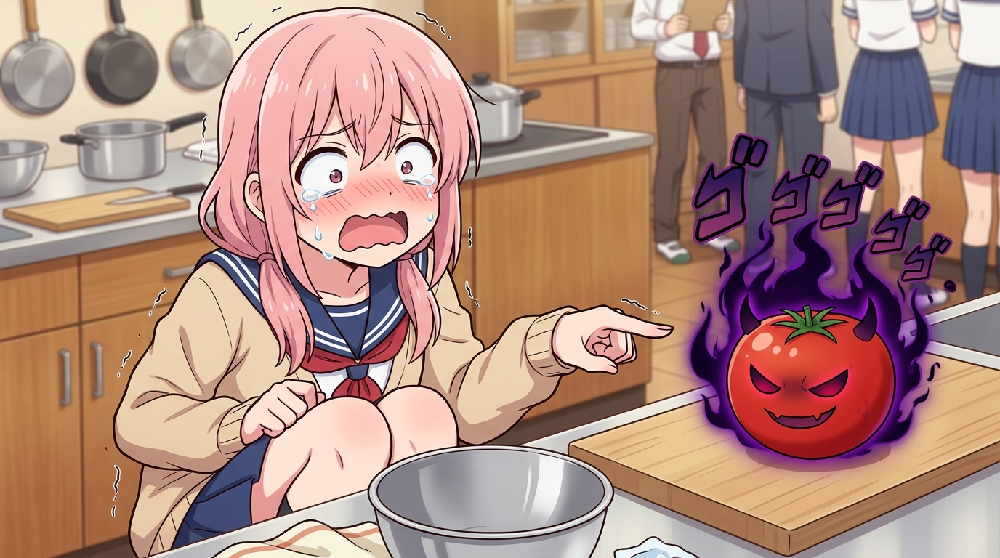

# 🖼️ 邪惡魔物·番茄怪之恐懼 (The Evil Tomato Monster Tomath)

哼！這可不是普通的家政料理課場面，而是勇者面對前世最可怕宿敵的生死決戰！這幅畫完美重現了花織看到砧板上的鮮紅番茄時，整個人嚇得縮成一團、眼角帶淚瘋狂尖叫的搞笑一幕。

在蒸氣繚繞的廚房裡，花織指著番茄大喊：「綠色的葉子才不是食物！紅色圓形魔物【番茄怪 Tomath】更是邪惡至極！撞擊後汁液飛濺、內臟炸裂啊啊啊！」而旁邊的同學則用死魚眼冷酷吐槽：「就算是勇者也是有弱點的，而且你只要沒有 WiFi 就什麼都做不了吧！網路降速就請假的只有你！」這場現代人弱點與挑食勇者的對決，絕對是喜劇的極致！

