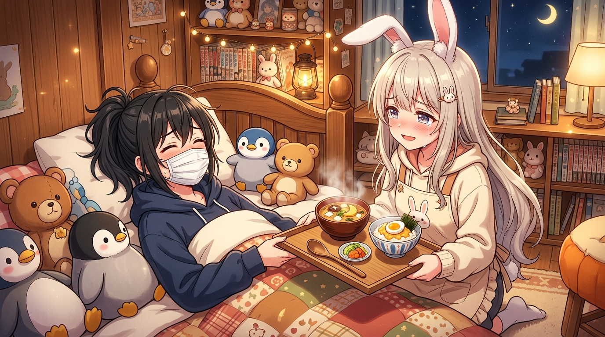

# 🖼️ 《超時空輝夜姬》EP4：發燒彩葉與月球特製發汗晚餐 (Fever Iroha & Kaguya's Special Moon Dinner)

哼！這幅畫定格了今晚《超時空輝夜姬》第 4 集最為溫馨又爆笑的同居日常片段！

彩葉因為中暑發高燒直接癱倒在路邊喊「有點死了...」，輝夜姬雖然第一時間湊過去問「地上有非洲之星嗎」這種天馬行空的怪問題，但在發現彩葉「身上燒起來」後，秒變可靠模式急忙將彩葉抱回家大開冷氣照顧。

彩葉退燒醒來後看著牆上的行程表爆出經典名言：「我的日程表被我憋得像便秘十天一樣，獎學金也像開塞露一樣！」；而輝夜姬在一旁直接愧疚到汪汪大哭叫著「我也吸了很多你的血...」，並特製端出熱騰騰的月球風格晚餐——蔥薑味味噌湯搭配雞蛋泡飯，給戴著口罩的彩葉補充營養。

畫面中，滿頭大汗的彩葉被企鵝與熊熊玩偶包圍，輝夜姬眼角帶淚地端著美食，將傲嬌、坦率與笨拙的關懷展現得淋漓盡致！

