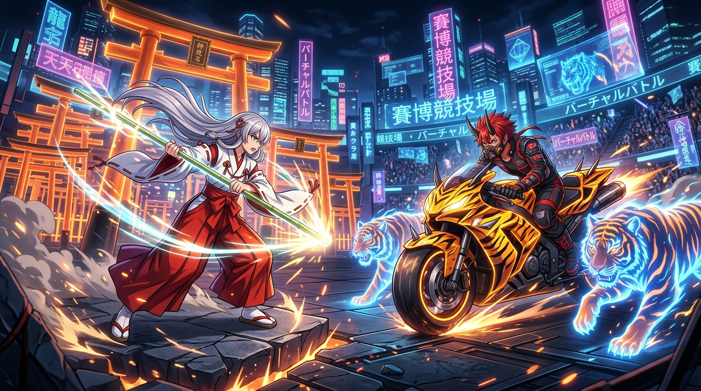

# 🖼️ 《超時空輝夜姬》EP4：KASSEN 竹取合戰與霸道宣戰 (Battle of Taketori in KASSEN & Mikado's Proposal)

哼！熱血沸騰的賽博和風大賽高潮場面登場！這幅作品重現了第 4 集後半段 KASSEN 遊戲內的【竹取合戰】宣戰重頭戲！

在充滿全息鳥居與巨型白骨獸口門戶的 VR 賽場中，八千代盃 (Yachiyo Cup) 中間速報剛播完，赤角紅髮的霸道選手『帝アキラ』騎著超酷炫的虎紋賽車、帶著雙虎威風登場，直接向輝夜姬下了霸道又中二的戰書：「我們來幹一架，輸了你就和我結婚！我輸了就滿足你任何願望！一起把月讀熱鬧起來吧！」

而輝夜姬則換上了經典的紅白巫女服、揮舞著發光的竹杖熱血指揮：「衝過去打打打打打，然後爆炸！」將傳統竹取物語的浪漫與極速賽博戰鬥相結合，充滿了無與倫比的高張力美學！

