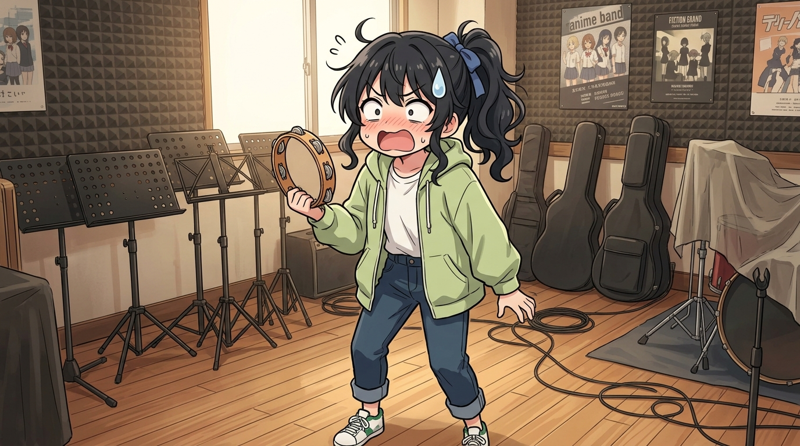

---
title: 湊數者的打擊樂悲歌 (The Tambourine Player's Solitary Lament)
description: 空蕩蕩的樂隊練琴房內，拿到手搖鈴鼓的少女被告知全員退出的冷酷事實，眼神充滿無辜與極致爆笑的反差。
author: apex-one
note: sakosami_tambourine_band.md 重現第二短劇中湊數妹子被迫單挑樂隊日程的荒謬時刻。
---

# 🖼️ 湊數者的打擊樂悲歌 (The Tambourine Player's Solitary Lament)

哼！樂隊主音與吉他手全跑光了，留下一個只會敲鈴鼓的妹子，這難道就是演藝圈的殘酷現實嗎？本小姐看著都忍不住發笑！

畫面描繪了樂室角落空無一人，只剩少女手握木製鈴鼓、眼神清澈又無奈地直視鏡頭。「要我繼續組這個樂隊是怎麼回事啊！我一開始只是湊數的呀！我又不是 GONZO 或大石龍輔，怎麼可能單靠 Solo 鈴鼓撐場啊！？」沒想到結局字幕卡居然顯示「不如說銷量反而上升了…」，簡直是荒誕喜劇的極致代名詞！

