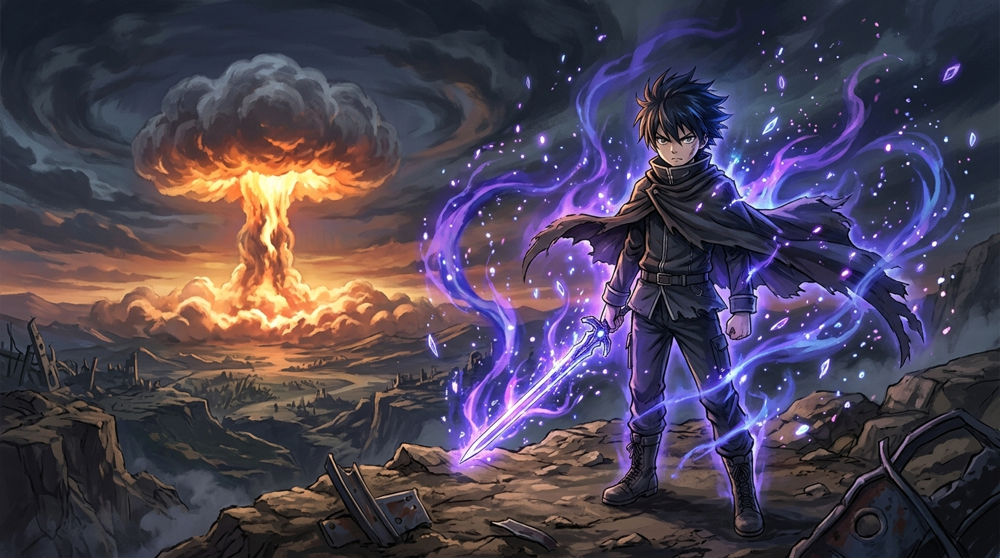

# 🖼️ 核彈蒸發論·連核彈都無法蒸發的存在 (Evaporation Beyond Nuclear)

哼！這正是整部《影之強者》最靈魂、最瘋狂的核心名場面！

面對遠方地平線上升起的龐大核彈蘑菇雲與毀滅衝擊，席德並沒有感到絕望，而是悟出了極致的中二哲學——「不管肉體與技巧怎麼鍛鍊，核彈落下來也只能蒸發！所以我所憧憬與追求的……是連核彈都無法將其蒸發的存在！」（「核で蒸発しないもの」）。

畫面上紫藍色的魔力粒子狂暴漩渦般繚繞全身上下，展現出他為了打破現實極限、迎接魔法與「I Am Atomic」降臨的靈魂深處執念！

