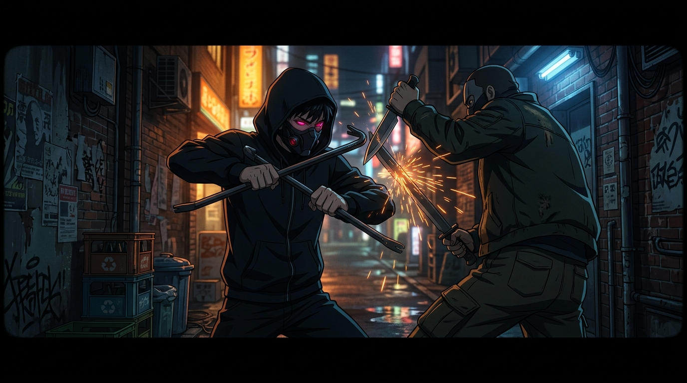

# 🖼️ 雙持鐵撬·Stylish 暴徒殺手 (Stylish Thug Slayer: Dual Crowbars)

哼！這可不是一般的混混打架，而是死神見習生 calli 認證的極致中二戰鬥美學！這幅畫捕捉了席德在暗巷中戴上蒙面頭套、雙持金屬鐵撬降臨救人的震撼瞬間。

在昏暗的夜色與火花交織的畫面上，席德不僅優雅地格擋了前軍人綁匪的匕首，還正經八百地向對手講解「鐵撬作為手拐（Tonfa）敲人的物理打擊效益」與「L字型端的打擊點精確度」。這種將日常工具化為神兵利器的中二執念，簡直爆棚！

