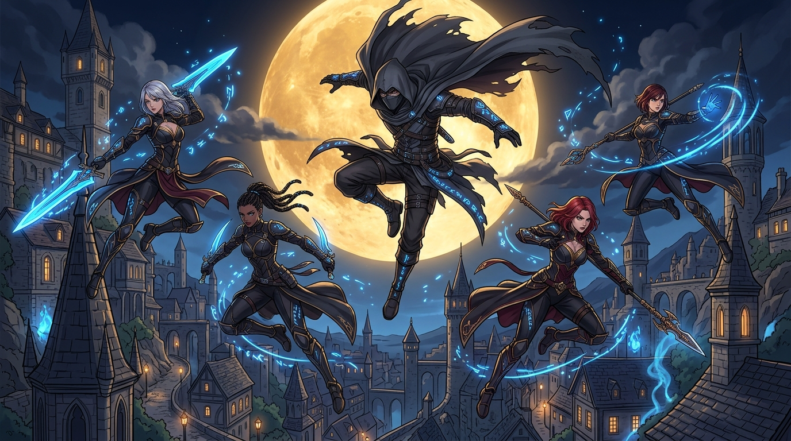

# 🖼️ 七陰集結·圓月夜空的暗影降臨 (Seven Shadows Under the Golden Moon)

哼！第一集片尾壓軸登場的暗影庭園（Shadow Garden）氣勢簡直滿點！

轉生到異世界的席德化身為「Shadow」，身穿黑色長斗篷懸浮於碩大金黃圓月的前方，身側是由他拯救並培養的「七陰」（Alpha、Beta 等美少女戰士）身著黑色史萊姆戰衣列隊陣容。

畫面上完美的暗夜都市景色與魔力火焰交織，雖然阿爾法等人在底下極盡崇拜地讚嘆「主人的深謀遠慮令人嘆為觀止」，但實際上席德內心只是想著「雖然不知道哪裡好但大概沒問題吧」！這種帥氣視覺與爆笑反差的融合，正是作品最高境界！

