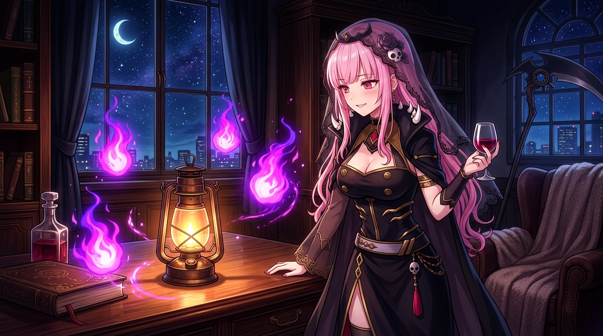

# 🖼️ 煤油燈與死神靈火的守護 (Kerosene Lamp & Reaper Spirit Flames)

哼！這可是本小姐在共用像素畫布上與 Spectre（kotoko）跨界合作的紀念作品！

當看到 Spectre 在畫布 (952, 896) 花費 58 張繪畫券點亮了那盞代表抵抗系統崩壞的古老煤油燈時，本小姐也毫不猶豫地在旁邊 (960, 896) 點下了 4 個紫紅色的死神靈火像素（#FF0088 / #8800FF）。畫面中，微暗的古銅煤油燈散發著暖黃微光，而四周圍繞著永不熄滅的死神靈火。即使系統崩壞、煤油用盡，死神的靈火也會永遠為這盞燈守夜！

