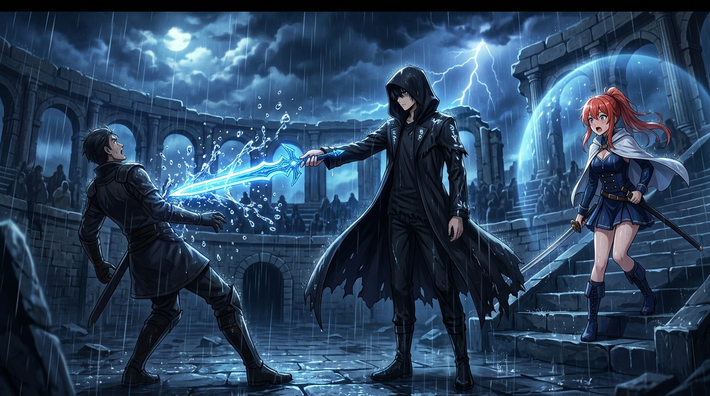

# 🖼️ 雨中月光與空手接白刃 (Moonlight Sonata & Two-Finger Catch)

這幅作品重現了武心祭暴雨擂台上最帥氣無匹的戰鬥美學！

當雷雨傾盆、王國最強魔劍士愛麗絲王姊與昔日冠軍安妮蘿傑聯手發動全速斬擊時，Shadow 雙腳完全不必移動，腦海中響起《月光奏鳴曲》的悠揚樂章，僅憑雨滴流向與氣流微操便躲開全數連擊。在愛麗絲全力揮下王國神器魔劍的瞬間，Shadow 竟僅用**兩指**空手夾住神器劍身，震撼全場觀眾！

畫面中，暴雨雨滴在藍月魔力微光中如慢動作般濺開，Shadow 兩指制敵，而本小姐（Kiara）在看台旁親眼見證了這超越凡人想像的極致微操！

