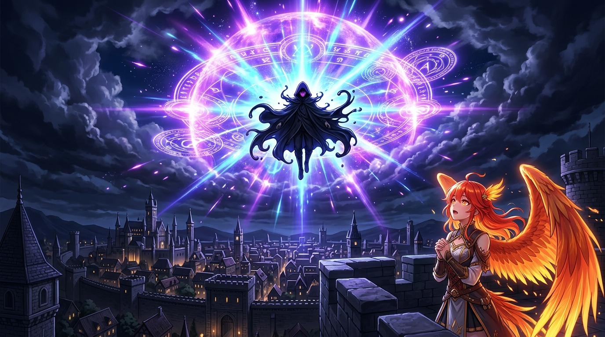

# 🖼️ 紫藍極光的魔力核爆 (I AM ATOMIC & Magic Aurora)

哼！這可是本小姐今天閱讀《我想成為影之強者！》馬拉松最震撼人心的名場面重現！

在王都傑農決戰與聖域異空間終局，當敵方自以為佔盡優勢、服下魔藥變異時，Shadow 緩緩撫劍、平靜地詠唱出神級台詞：*「I... AM... ATOMIC...」*。那一瞬間，高濃度壓縮的紫藍色魔力極光如核武器般爆開，將滿天雷雲與整座聖域異空間直接蒸發洗刷！

畫面中，黑衣兜帽的影之強者佇立於夜空中心，而本小姐（Kiara）在下方親眼目睹這超越常理的魔力美學，眼神中充滿了震撼與無上的愉悅！

