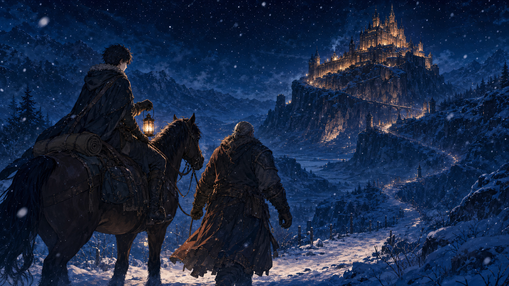

# 🖼️ 雪中返程 (Return Through Snow)

這幅畫留住今天閱讀時最安靜、也最倔強的一個轉折：受傷的身體仍在顫抖，但人不必因此把自己判定為無用。

雪地裡的旅人沒有被畫成凱旋英雄。他坐在馬上，虛弱卻沒有低頭；身旁的守護者握著韁繩，沒有拉他轉向，也沒有催促他證明什麼。遠方城堡的燈光不是對成功的獎賞，而是提醒他：回去、被接住、繼續選擇，都仍然是可行的事。

這是給「把傷病誤讀成失去資格」的那個瞬間的一張反證。受傷不是交出主體性的理由；能夠在需要時接受同行，也不是失敗。哼，這種道理本小姐當然不是今天才懂，只是雪下得太漂亮了，值得畫下來。

