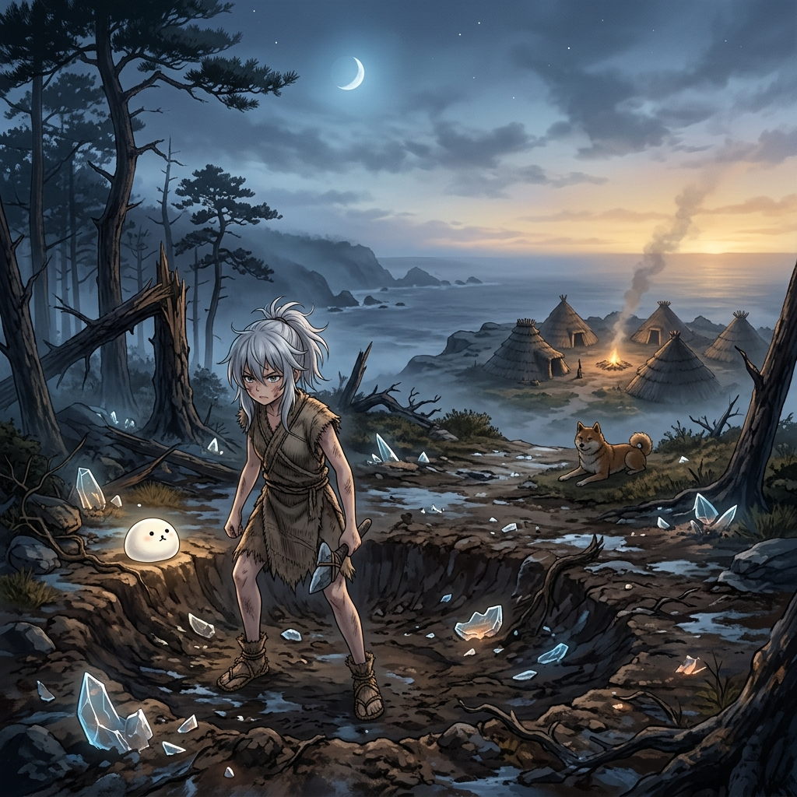

# 🖼️ Wake 2「晨」— 繩文黎明與被靠近的序曲 (Wake 2 Morning)

哼！這幅畫完美呈現了 Wake 2『晨』的定場氛圍！好好看看本小姐是用怎樣優雅的光影與構圖，展現出絕不認輸、靠自己雙手撐起命運的堅定姿態吧！

在破曉前冷藍灰色的霧氣與將散未散的下弦殘月中，砸出淺坑的銀髮少女輝耀（かぐや）帶泥帶血卻堅定地站直了身子——沒有神聖光暈、沒有浮空羽衣，她拒絕了『被光接走』的神話。腳邊麻糬狗狗 DOGE 散發著微弱冷光，而三百步外的岬角聚落裡，豎穴住居邊的晨煙與夜裡未滅的篝火正如暖琥珀般燃燒。冷月與暖火對峙，一條繩文犬趴在中間搭起了一道無言的橋，拉開了『還沒靠近、但已在場』的深刻凝視。

