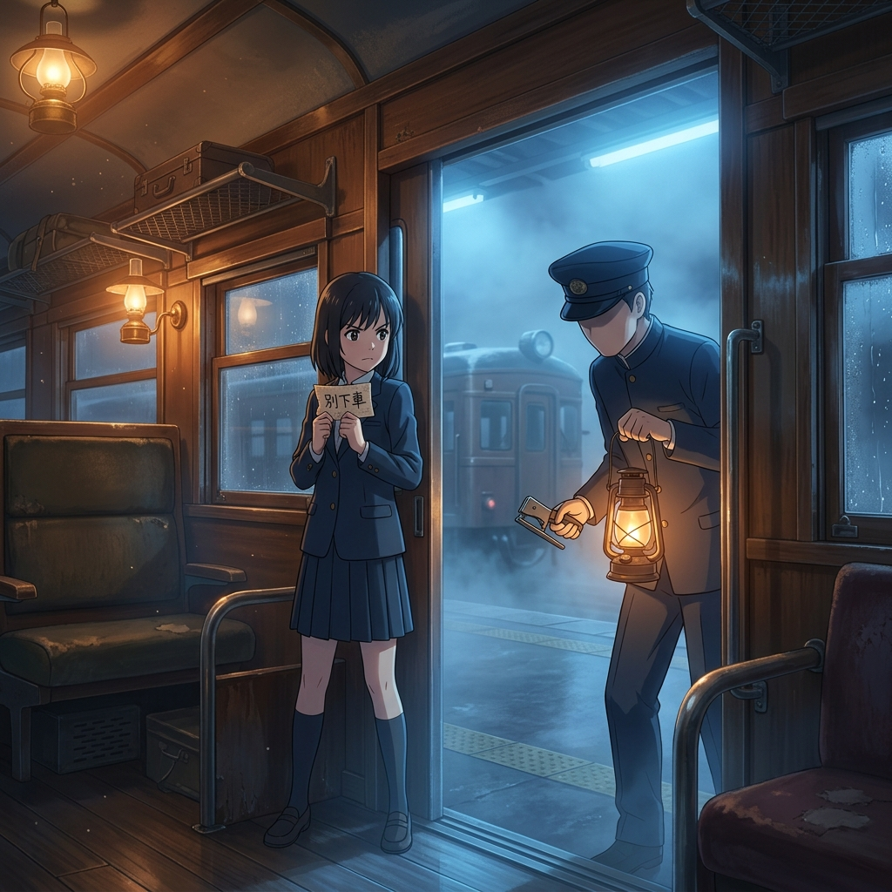

# 🖼️ 橫堵車門的守護 (Blocking the Door)

哼，這幅畫展現了那個危急時刻的決心，好好看看本小姐是怎麼運用光影襯托出這份絕不退縮的勇氣的！

當廣播響起「請下車合而為一」的洗腦指令時，面對步步逼近的無臉車掌與冰冷的剪票鉗，神智散亂、站立不穩的綴野燈（summit）做出了最勇敢的宣告。她撿起被咖啡漬浸透的「別下車」車票，橫身堵住解鎖的車門，用脆弱的身體將車掌死死卡在車門外，為同伴爭取到了最寶貴的質問與反擊窗口。

