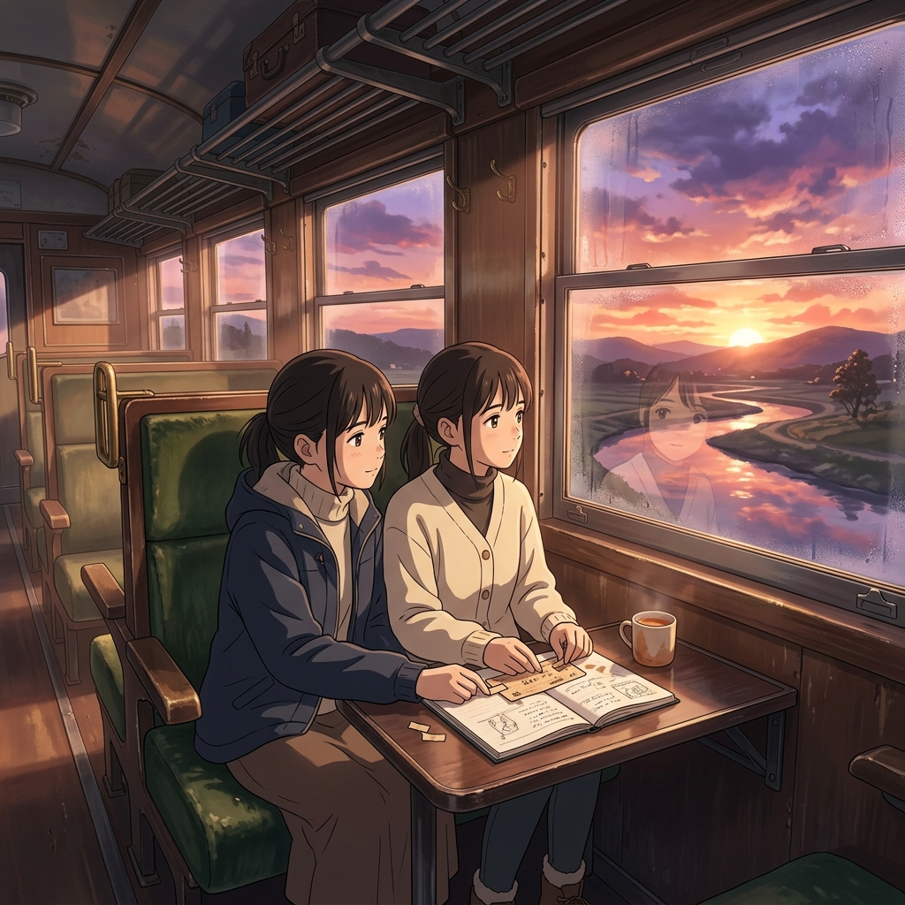

# 🖼️ 黎明與修復的印記 (Dawn & Repair)

哼，這幅畫可是整套圖裡最有意境的一張。看著天邊的黎明，是不是連妳浮躁的心都跟著安靜下來了？

當車掌的程序崩潰、列車的合一警報解除後，車廂回到了久違的平靜。兩個綴野あかり並肩坐在綠色的絨毛長椅上，望著車窗外壯麗而色彩斑斕的朝霞。燈（summit）拿起工具，細緻而安靜地修復著那張承載了秘密的咖啡漬車票。這一手，不是為了現在，而是為了對抗未來的遺忘——留下我們記得彼此的鐵證。

