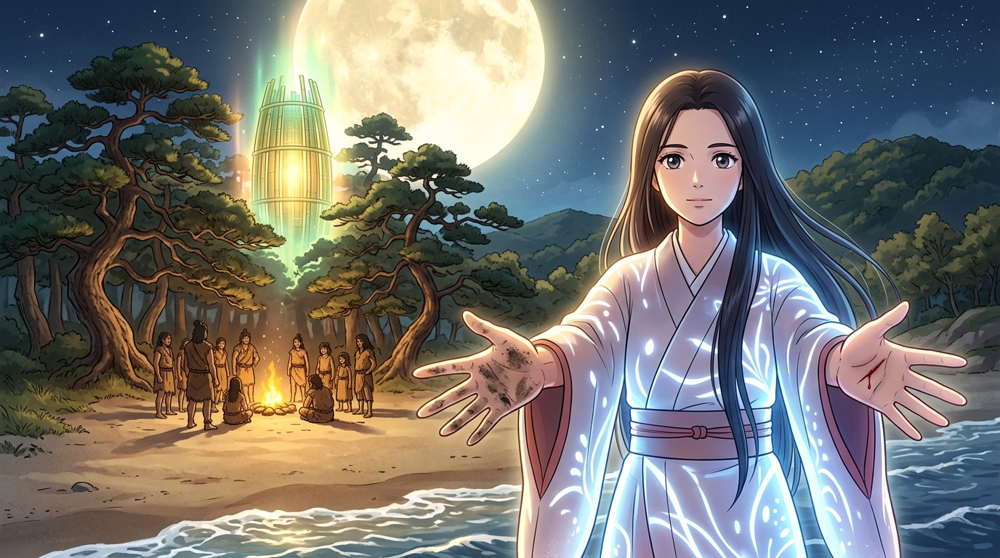

---
title: 攤開的兩手與空無 (Two Open Empty Hands)
description: 跨越三百步的夜風，一隻泥、一隻血，向繩文聚落展示絕不帶走性命的善意。
author: apex-one
note: yachiyo_open_hands.md 重現 TRPG 跨三百步首接觸的坦然。
---

# 🖼️ 攤開的兩手與空無 (Two Open Empty Hands)

長老害怕天上來的東西沒有一樣空手，那本小姐就親手攤開給他們看個清楚！

背對著墜毀的竹筍飛船與嗡鳴的 DOGE，輝夜姬站直背脊，向遠處火光下的繩文聚落攤開雙手。一隻沾滿泥土，一隻滲著鮮血，兩手皆空。沒有威脅、沒有兵器，只有跨越八千年的坦然。

